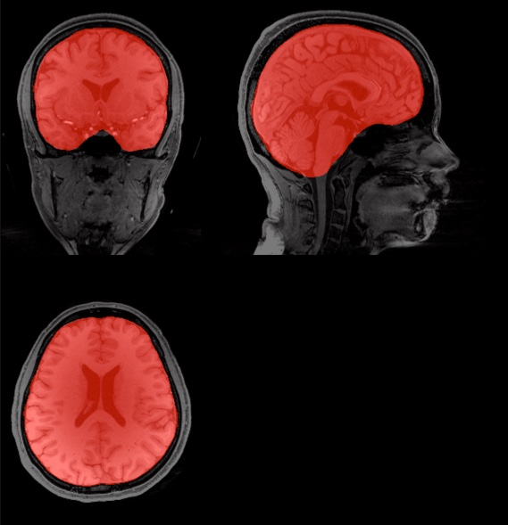

# Super-BET2
Super Brain Extraction Tool (SUPER-BET2) derived from FMRIB Software Library (FSL) v5.0 performs a much better brain segmenation than the traditional BET2 with default configuration. It estimate the inner and outer skull surfaces as well as the outer scalp surface, if you have good quality images.

The algorithm outputs the following files:

filename_superBET2_inskull_mask.nii.gz  
filename_superBET2_outskin_mask.nii.gz  
filename_superBET2_outskull_mask.nii.gz  
filename_superBET2_skull_mask.nii.gz  

Most people are interested in the inskull brain mask, i.e. filename_superBET2_inskull_mask.nii.gz.

NOTE: This program may not work well if there is a too much fat between the scalp and the skull.
